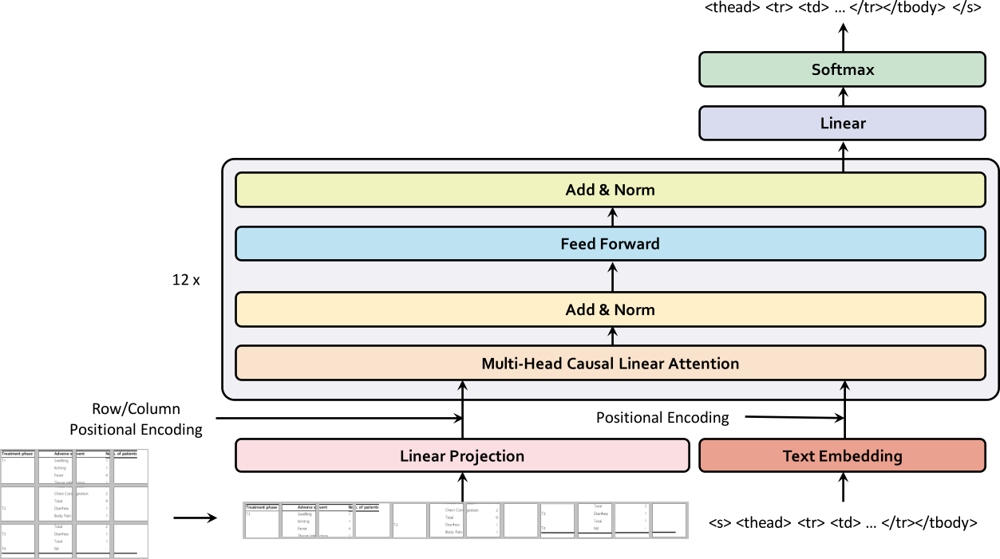

# Linear Transformer for Table Recognition

## Introduction

This is the code repository for participation in [ICDAR2021 Competition on scientific literature parsing - Task B: Table recognition](https://icdar2021.org/competitions/competition-on-scientific-literature-parsing/) (Team Name: LTIAYN = Kaen Context).


<div align=center>

</div>


- Dataset: [PubTabNet](https://github.com/ibm-aur-nlp/PubTabNet)
- Metric: [Tree-Edit-Distance-based Similarity(TEDS)](https://github.com/ibm-aur-nlp/PubTabNet/tree/master/src)
- Baseline: [Image-based table recognition: data, model, and evaluation](https://arxiv.org/abs/1911.10683)


## 0. Before Training

1. change the prefined data directory '/data/private/datasets/pubtabnet' to your own data directory in 'processing_pubtabnet.py', 'configs/linear_transformer.yaml'
2. `python processing_pubtabnet.py`


## 1. Training

``` bash
python train.py model_dir=base
```


## 2. After Training

1. inference

```bash
python inference.py -m "./outputs/base/" -i "/data/private/datasets/pubtabnet/val/" -o "./results/val1" -nt 16 -ni 0 -na 20
python inference.py -m "./outputs/base/" -i "/data/private/datasets/pubtabnet/val/" -o "./results/val1" -nt 16 -ni 1 -na 20
...
python inference.py -m "./outputs/base/" -i "/data/private/datasets/pubtabnet/val/" -o "./results/val1" -nt 16 -ni 15 -na 20
```

2. evalution

```bash
python score.py
```
